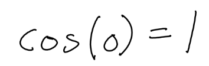

# Handwritten Mathematical Equation Transcription and Correction

CSE 60880: Neural Networks

John Kim (dkim37@nd.edu), Tram Trinh (htrinh@nd.edu)

## Part 1: High-Level Solution (02/09/25)

### Overview

The goal is to develop a model that transcribes handwritten mathematical equations into syntactically and semantically correct LaTeX code. The pipeline involves two stages:

1. **Stage 1: RNN/Transformer Transcription**
   

Since we are working with sequential data (InkML format), we will experiment with RNN and Transformers for transcribing handwritten equations into raw LaTex. The model will be built from scratch to allow completer control over architecture and training. We believe the main challenge is to how to take advantages of sequential data to extracts relevant features and maps them to a sequence of tokens corresponding to LaTex commands (e.g., `\frac`, `\sqrt`, `^`, etc.)
- Feature Extraction: Learn high-level features distinguishing different mathematical symbols.
- Sequence Mapping: Output an ordered sequence of tokens that accurately represents the mathematical expression.
- Handling Varying Input Quality.

2. **Stage 2: LLM Correction**

The raw LaTex output from the transcription model is processed by a LLM. The LLM refines the transcription by resolving ambiguities, fixing syntax errors, and ensuring structural consistency.

Example: `\cos(0) = 1` might be incorrectly transcribed but fixed at this stage.

We are planning to experience some open-source LLMs are are free and suitable for this task. Some of our options are:
- : Released by Meta, a collection of models ranging from 7 billion to 70 billion parameters and is designed to be efficient and effective across multiple tasks, including language understanding and generation.
- : BLOOM is a 176-billion-parameter multilingual model, and it is open-access and has been trained on a diverse dataset.
- : Mistral AI's 7.3-billion-parameter model employs grouped-query attention for optimized performance.
- 

This two-stage approach helps in addressing key challenges in handwritten equation recognition, such as symbol ambiguities (e.g., `∆` vs. `∇`),  structural relationships (e.g., fractions, matrices), and the high variability in handwriting styles.

### Dataset

We plan to use the data set described in the following paper: https://arxiv.org/pdf/2404.10690

The dataset consists of:
- 230,000 human-written samples
- 400,000 synthetic samples
- 244 mathematical symbols + 10 syntactic tokens
- Categories of symbols:
  - Latin letters (a-z, A-Z)
  - Numbers (0-9)
  - Punctuation and symbols (.;:+-/… etc.)
  - Greek characters
  - Mathematical constructs (\frac, \sqrt, etc.)
  - Structural elements (nested expressions, matrices, binomial coefficients, etc.)

 ### Discussion 

One of the biggest challenges we face in handwritten mathematical expression recognition is the high variability in handwriting styles. Differences in stroke patterns, writing pressure, and individual character formation make it difficult to generalize across users.
- Cursive and print letters and characters
- Overlapping strokes: Complex expressions like summations (\sum), integrals (\int), or nested fractions often have overlapping strokes.
- Distinguishing similar looking symbols, such as `0` vs. `O`, `1` vs. `l`, and `∆` vs. `∇`.

Unlike traditional OCR tasks, we need to capture the hierarchical structure of symbols to recognize mathematical equations accurately. Our model must identify individual symbols and their relationships, distinguish between different mathematical constructs like matrices, fractions, and binomial coefficients, and ensure the correct placement of subscript and superscript elements. To achieve accurate transcription, we need to effectively detect symbols, strokes, and structural relationships, preserving the intended meaning of handwritten equations.

